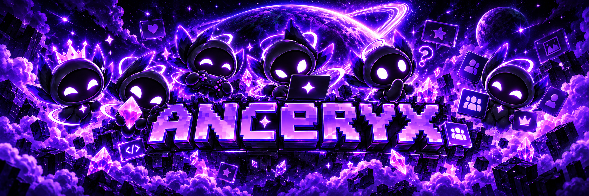

  

  <strong>Anceryx</strong>

<h1 align="center">Anceryx</h1>

  <strong>Seu espaço. Sua comunidade.</strong> 
  Your space. Your community.

  <a href="#-português">🇧🇷 Português</a>
  &nbsp;•&nbsp;
  <a href="#-english">🇺🇸 English</a>

---

## 🇧🇷 Português

### ✦ Sobre o Anceryx

O **Anceryx** é uma plataforma social criada em torno de pessoas, comunidades, conversas e identidade digital.

Descubra pessoas e comunidades, compartilhe o que importa para você, converse com amigos, participe de chamadas, faça transmissões e crie um perfil que realmente tenha a sua cara.

Estamos construindo um lugar onde tudo se conecta sem que você perca sua identidade no caminho.

### ✦ O que estamos construindo

- Feed social e descoberta
- Comunidades e fóruns
- Chat em tempo real
- Chamadas de voz e vídeo
- Transmissões ao vivo
- Perfis personalizáveis
- Experiências Premium
- Aplicativo para desktop

### ✦ Nossos projetos

Esta organização reúne os projetos, serviços e ferramentas que formam o ecossistema do **Anceryx**.

Algumas partes da plataforma ainda estão em desenvolvimento e podem permanecer privadas até estarem prontas.

---

## 🇺🇸 English

### ✦ About Anceryx

**Anceryx** is a social platform built around people, communities, conversations and digital identity.

Discover people and communities, share what matters to you, talk with friends, join calls, go live and create a profile that truly feels like yours.

We're building a place where everything feels connected without losing your identity along the way.

### ✦ What we're building

- Social feed and discovery
- Communities and forums
- Real-time chat
- Voice and video calls
- Live streaming
- Customizable profiles
- Premium experiences
- Desktop application

### ✦ Our projects

This organization brings together the projects, services and tools that power the **Anceryx** ecosystem.

Some parts of the platform are still under development and may remain private until they're ready.

---

  <strong>✦ Anceryx</strong> 
  Connect. Create. Belong.

